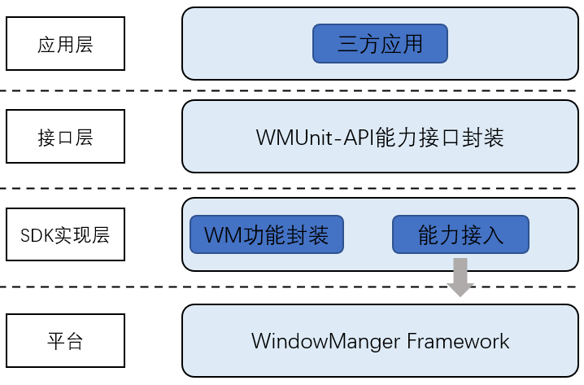
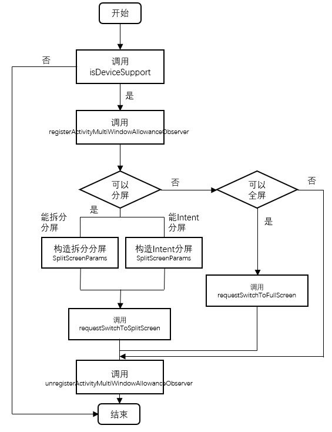

# 窗口能力介绍
## 概述
WMUnit是窗口能力的开放接口，目前三方应用可以通过WMUnit实现在单一应用中完成应用内分屏，满足用户微信同时聊天、看视频或看公众号，WPS中同时查看多个文档等多任务操作需求

## 支持设备
ColorOS13及以上版本的Find N系列折叠屏手机、OPPO APD平板设备

## 功能介绍
### 应用内分屏
应用内分屏可以可以一个应用同时在前台展示两个页面，两个应用分别独立地运行，且相互之间不受影响。

## 工作原理
### 架构简介


### 应用层
基于窗口开放能力而开发的用户应用程序。
### API 接口层
提供窗口能力开放的具体功能和三方应用交互的接口，通过此接口接入窗口开放能力。
### SDK实现层
主要是对窗口管理接口进行一层封装，实现OPPO窗口能力开放。

## 隐私说明
1、您（开发者）应仔细阅读[OPPO开发者服务协议](https://open.oppomobile.com/new/developmentDoc/info?id=10449 "OPPO开发者服务协议")，特别是与您的行为权益责任密切关联的条款，并严格遵循该服务协议。
2、您仅拥有合法使用OPPO开放能力API和SDK的权利，并根据开发指导做好相应安全措施，包括不限于：签名校验，Https请求，代码混淆、加壳等。
3、您不得向任何单位或个人出售、转让、转授权OPPO WMUnit窗口开放能力的代码、API及开发工具等。
4、您应当妥善使用OPPO WMUnit窗口开放能力，您不得使用OPPO WMUnit窗口开放能力用于法律法规禁止提供的内容或用途，包括但不限于：
1）不得恶意对OPPO WMUnit窗口开放能力进行干扰、破坏、修改、妨碍软件正常使用；
2） 不得进行任何危害OPPO WMUnit窗口开放能力安全的行为，如故意传播恶意程序或病毒行为；
3）从事其他法律法规、政策及公序良俗、社会公德禁止的行为以及侵犯其他个人、公司、社会团体、组织的合法权益的行为；
5、若我们收到举报或发现，您利用WMUnit窗口开放能力用于国家法律法规禁止提供的内容或用途或违反OPPO开发者服务协议的约定，我们有权立即终止您对WMUnit窗口开放能力的使用，并禁封您的开发者账号，因此而导致相关损失，由您自行承担责任，给我们和用户造成损失的，应予全额赔偿。

# 窗口能力接入指南
## 开发流程
WMUnit功能包获取版本号、获取SplitScreen能力支持状态、设置分屏参数、进入分屏状态、退出分屏状态等。
- 获取版本号：获取当前版本号
- 获取SplitScreen能力支持状态：获取当前设备平台是否支持SplitScreen能力
- 设置分屏参数：设置分屏时使用的参数
- 进入分屏状态：注册分屏相关监听器并根据参数进入分屏状态
- 退出分屏状态：注销分屏相关监听器
## 环境配置
### 环境准备
涉及AS版本/手机版本
### 配置build.gradle
#### 修改项目的build.gradle文件
```
buildscript {
    repositories {
        ...
        maven {
            url "https://repo1.maven.org/maven2/"
        }
    }
}
allprojects {
    repositories {
        ...
        maven {
            url "https://repo1.maven.org/maven2/"
        }
    }
}
```

#### 修改Module的build.gradle文件
修改具体使用到WMUnit的Module的build.gradle，进行如下配置：
```
dependencies {
    ...
    compileOnly fileTree(dir:'libs', includes: ['*.aar'])
    compileOnly 'com.oplus.ocs:wmunit:1.0.0'
}
```

# 窗口能力开发指南

## 接口说明
### MultiWindowTrigger类
| 接口                           | 说明               |
| ----------------------------- | --------------------------- |
| int getVersion() | 查询当前SDK版本号<br> 返回值：获取SDK版本号的int值 <br>初始版本号：10000表示1.0.0 |
| boolean isDeviceSupport(Context context) | 查询该设备是否支持单应用分屏能力 <br> 参数：<br>context 待分屏操作activity的上下文 <br> 返回值：<br> 是否支持WMUnit能力，取值true支持 ， false不支持 |
| boolean  requestSwitchToSplitScreen(Activity requestActivity, SplitScreenParams params) | 请求requestActivity进入分屏 <br> 参数：<br> requestActivity：请求进入分屏的Activity <br> params：SplitScreenParams类型的参数，详细信息参考后续接口说明 <br>返回值：<br> 此次请求的应用内分屏是否成功，成功为true并进行分屏状态，失败为false不执行其他操作 |
| boolean  requestSwitchToFullScreen(Activity requestActivity) | 请求requestActivity进入全屏（操作前requestActivity需处于分屏状态）<br> 参数：<br> requestActivity：请求进入全屏的Activity <br> 返回值： <br> 此次请求的requestActivity进入全屏是否成功，成功为true并进入全屏状态，失败为false不执行其他操作 |
| void registerActivityMultiWindowAllowanceObserver(Activity activity, ActivityMultiWindowAllowanceObserver observer) | 注册一个监听器，监听activity是否能进入分屏/全屏<br>参数：<br> activity：待监听的Activity <br> observer：待注册的监听器 |
|void unregisterActivityMultiWindowAllowanceObserver(Activity activity, ActivityMultiWindowAllowanceObserver observer) | 对指定Activity注销掉原先注册的监听器 <br> 参数：<br> activity：待操作的Activity <br> observer：待注销的监听器 |

### SplitScreenParams类
| 接口                           | 说明      |
| ----------------------------- | --------------------------- |
|Builder Builder()  | 创建一个默认的SplitScreenParams构造器 <br> 返回值：Builder对象 |
|Builder Builder(SplitScreenParams original) | 根据已有SplitScreenParams参数创建一个构造器 <br> 参数： <br> original：已有的SplitScreenParams参数 <br> 返回值： <br> 根据已有参数赋值的Builder对象 |
| Builder Builder.setSelfSplit() | 设置自分屏位为true <br> 返回值：当前Builder对象 |
| Builder Builder.setLaunchIntent(Intent intent) | 设置启动Intent <br> 参数： <br> intent：启动Intent <br> 返回值： <br> 当前Builder对象 |
| Builder Builder.setLaunchPosition(int position) | 设置启动位置 <br> 参数： <br> position：启动位置 <br> 返回值：当前Builder对象 |

### ActivityMultiWindowAllowance类
| 接口                           | 说明      |
| ----------------------------- | --------------------------- |
| ActivityMultiWindowAllowance(boolean allowSelfSplitToSplitScreen, boolean allowSwitchToSplitScreen, boolean allowSwitchToFullScreen) | ActivityMultiWindowAllowance构造方法，包含了与activity分屏相关的属性值 <br> 参数： <br> allowSelfSplitToSplitScreen：当前activity状态是否支持自分屏 <br> allowSwitchToSplitScreen：当前activity状态是否支持分屏 <br> allowSwitchToFullScreen：当前activity状态是否支持切换到全屏 |

### ActivityMultiWindowAllowanceObserver类
### ActivityMultiWindowAllowance类
| 接口                           | 说明      |
| ----------------------------- | --------------------------- |
| ActivityMultiWindowAllowanceObserver() | 默认构造方法 |
| void onMultiWindowAllowanceChanged(ActivityMultiWindowAllowance allowance) | 设置启动位置activity状态变化时的监听方法，由系统侧自动回调 <br> 参数： <br> allowance：封装了与activity分屏相关的属性值 |

## 调用步骤



### 判断是否支持WMUnit功能
通过MultiWindowTrigger实例和context参数判断是否支持WMUnit功能。
**注意请一定要在调用WMUnit能力之前，先检查当前设备和版本是否支持此能力，并且用try-catch块捕获相关异常。**
否则可能会出现预期外的结果，包括获取到无效的返回结果、甚至可能会导致应用程序闪退。
```
try {
    MultiWindowTrigger multiWindowTrigger = new MultiWindowTrigger();
    boolean isWMUnitSupported = multiWindowTrigger.isDeviceSupport(getApplicationContext());
    if (isWMUnitSupported) {
        Log.d("WMUnit", "WMUnit is supported.");
        ...
    } else {
        Log.d("WMUnit", "WMUnit is not supported!");
        ...
    }
} catch (NoClassDefFoundError e) {
    Log.d("WMUnit", "WMUnit is not supported!");
    ...
}
```

### 获取版本号
通过MultiWindowTrigger实例获取当前SDK版本号
```
MultiWindowTrigger multiWindowTrigger = new MultiWindowTrigger();
int version = multiWindowTrigger.getVersion();
```

### 注册自分屏监听器
```
//在需要触发分屏的Activity内创建监听器实例
ActivityMultiWindowAllowanceObserver mAllowanceObserver = new ActivityMultiWindowAllowanceObserver() {
    
    //监听当前Activity状态，是否能进入分屏/全屏
    @Override
    public void onMultiWindowAllowanceChanged(ActivityMultiWindowAllowance allowance) {
        SecondaryActivity.this.runOnUiThread(new SecondaryActivityRunnable(SecondaryActivity.this, allowance));
    }
};
```

### 触发分屏
#### 触发拆分分屏
```
//在原Activity内触发拆分分屏
SplitScreenParams.Builder builder = new SplitScreenParams.Builder();
builder.setSelfSplit().setLaunchPosition(0);
this.mMultiWindowTrigger.requestSwitchToSplitScreen(this, builder.build());
```

#### 触发Intent分屏
```
//在原Activity内触发Intent分屏
SplitScreenParams.Builder builder2 = new SplitScreenParams.Builder();
builder2.setLaunchIntent(new Intent(this, ThirdActivity.class)).setLaunchPosition(0);
this.mMultiWindowTrigger.requestSwitchToSplitScreen(this, builder2.build());
```

### 已分屏Activity返回全屏
```
//注意requestActivity需要处于已分屏的状态，否则接口调用不生效
multiWindowTrigger.requestSwitchToFullScreen(requestActivity);
```

# 窗口能力版本更新说明

| 版本号 | 最低ColorOS版本 | 更新内容 |
| ------ | ----- | --------|
| 1.0.0 | ColorOS13.0 | 支持WMUnit应用内自分屏能力 |

# 窗口能力常见问题及FAQ

## 1、目前哪些设备、版本支持应用内自分屏能力？
目前只有ColorOS13以上的大屏设备，包括Find N系列折叠屏手机和OPPO Pad系列支持应用内自分屏能力。

## 2、自分屏应用有哪些要求和限制？
目前对分屏应用暂无明确要求和限制，只要对应设备和版本支持自分屏能力即可。

# 联系我们
亲爱的开发者，如果您在使用OPPO开放平台的过程中遇到任何问题，可以通过["在线客服"](https://chat.heytap.com/chat/h5/v2/index.html?sysnum=9f06d616a05a43a9a50421f5f0982e4d&channelid=64 "在线客服")进行反馈。
（客服在线时间为工作日8:30-20:30）